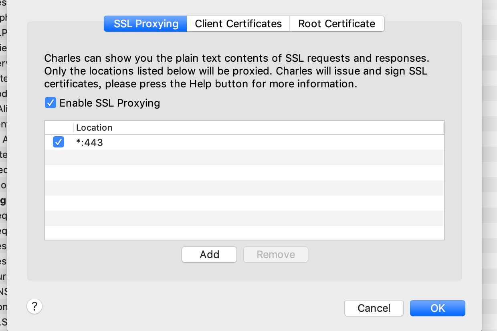

#### cocopods安装
安装教程参考了该链接（[参考地址](https://www.jianshu.com/p/f43b5964f582)），纯粹学习记录

配置ruby环境，目前Cocopods需求2.2.2版本及以上的ruby，如果版本小于该版本先进行ruby升级。

##### ruby升级步骤

1.查看当前ruby版本

```
ruby -v
```

2.安装rvm升级ruby环境

```
curl -L get.rvm.io | bash -s stable 
source ~/.bashrc
source ~/.bash_profile
```

3.查看rvm版本

```
rvm -v
```

4.列出ruby可安装版本信息

```
rvm list know
```

5.安装一个ruby版本(大于2.2.2,建议选择最新的)

```
rvm install 2.4.1
```

6.设置为默认版本

```
rvm use 2.4.2 --default
```

7.更换源（ruby-chain）

```
sudo gem update --system
gem sources --remove https://rubygems.org/
gem sources -a https://gems.ruby-china.org/
```
8.验证是否更换成功

```
gem sources -l
```

9.正式安装CocoaPods

```
sudo gem install -n /usr/local/bin cocoapods
```

10/如果安装了多个Xcode使用下面的命令选择

```
sudo xcode-select -switch /Applicaitons/Xcode.app/Contents/Developer
```

11.安装本地库

```
pod setup
```

以上为cocoapod安装步骤
第11步可以换成

```
git clone git://cocoapodscn.com/Specs.git ~/.cocoapods/repos/master
pod setup

```

___

#### Charles 代理使用

* 下载并安装charles
* charles代理配置
* 电脑设置中到当前ip地址，电脑和手机连接同一个网络，手机的代理设置为电脑的ip地址，端口为8888
* 手机和电脑分别安装根证书完成https代理

#### 下载并安装charles
[https://xclient.info/s/charles.html]()

#### charles配置
http配置如下图


ssl配置如下图



#### 代理配置
注意为同一网络即可

#### 安装根证书
首先为电脑安装根证书
help-> SSL Proxying-> install charles root cer
会下载证书并加入到钥匙串，此时证书还是未信任的，钥匙串中双击证书设置为信任

手机安装证书
前三部已经完成的情况下，浏览器输入chls.pro/ssl，此时为弹出是否安装证书的界面，安装提示安装。
最后还需要把此证书设置为手机的根证书，到通用-> 关于手机 -> 证书信任设置里面找到相关证书设置为信任。

charles其实就是一个典型的中间人攻击案例，手机安装的证书会对电脑的证书背书。


